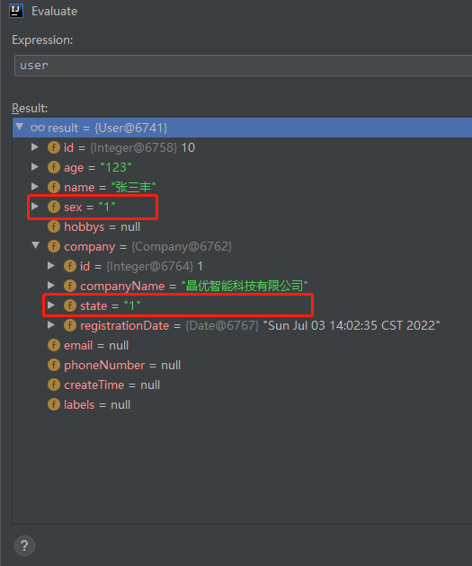
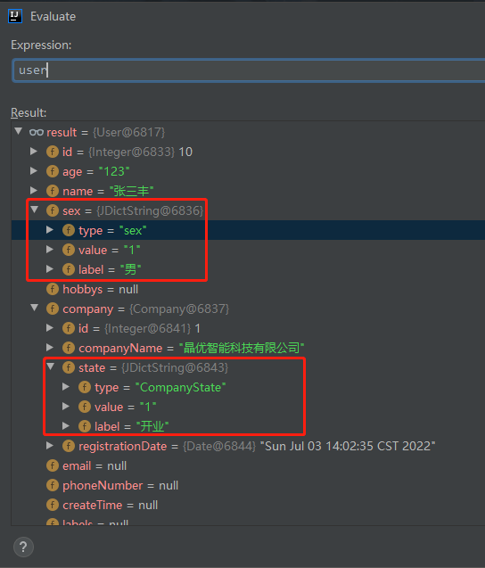

## 字典键值自动映射插件
#### 1、快速入门
##### 1.1、简介
  > 根据字典type、字典值自动映射相对应的字典键(label)。

例：
```java
public interface UserMapper {

    @Select({"select * from users where id=#{userId}"})
    User selectOneById(Integer id);
}
```

|原结果|映射后的结果|
|---|---|
|||


#### 2、配置
  > 注册字典Bean
```java
@Configuration
public class JDictConfig {

    /** 
     * JDictDataInputSource<T>
     * <T {JDictInteger|JDictString}> 根据字典值的类型决定
     *   a、dict_value为Integer时，T为JDictInteger
     *   b、dict_value为String时，T为JDictString
     *  示例如下：
     */
    @Bean
    public JDictDataInputSource<JDictString> dictDataInputSource(IDictDataService dictDataService) {
        return dictDataService::listDictDataByType;
    }
}

@Service
public class DictDataServiceImpl implements IDictDataService {
  @Override
  public List<JDictString> listDictDataByType(List<String> type) {
    // 模拟数据，具体实现可参考demo...
    List<JDictString> list = new ArrayList<>();
    JDictString dict = new JDictString();
    dict.setType("hobby");
    dict.setValue("11");
    dict.setLabel("篮球");
    list.add(dict);
    return list;
  }
}
```

#### 3、快速开始（基于Spring Boot）
##### 3.1、引入依赖
```xml
<!-- Maven方式引入 -->
<dependency>
  <groupId>io.github.chenyujie-lab</groupId>
  <artifactId>jm-dict-plugin</artifactId>
  <version>1.0.1</version>
</dependency>

<!-- Gradle方式引入 -->
implementation 'io.github.chenyujie-lab:jm-dict-plugin:1.0.1'
```
##### 3.2、启动类添加注解
```text
@EnableDictMapping
```
##### 3.3、配置文件
```
{mybatis|mybatis-plus}:
  type-handlers-package: jm.dict.plugin.handle
```
##### 3.4、实体类添加注解
```java
@JIncludeDict
public class DictUser implements java.io.Serializable {
    private String name;
    
    @JDictField(type = "sex", remark="这是字典字段，sex字典")
    private JDictString sex;
    // 其余略...
}
```
### 4、注解说明
* @EnableDictMapping
  > 是否开启字典项自动映射

* @JIncludeDict
  > 标识一个实体类中包含字典字段
* @JDictField
  > 字典字段注解
  
  |参数|类型|说明|默认值|
  |---|---|---|---|
  |type|String|字典类型|""|
  |remark|String|字典备注|""|

